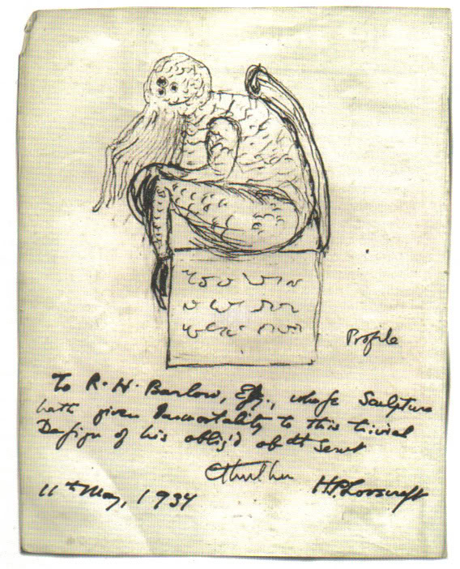

# Cthulhu: Deep Learning for demons


## You have just found Cthulhu.

Cthulhu is the deep learning framework to end them all. Let's head right into the singularity and
summon some demons already, shall we?

------------------

## Guiding principles

- __User irrelevance.__ Cthulhu realizes the complete irrelevance of mankind in the face of cosmic horrors in the universe. It puts user experience in the back seat, where it belongs. Cthulhu minimizes the number of user actions required to summon demons to make it easy for humans to replace themselves, simply and consistently.

- __Monstrosity.__ A model is understood as a sequence or a graph of standalone, fully configurable demons that can be plugged together with as few restrictions as possible. You have full access to the "Great Old Ones", a loose pantheon of ancient, powerful deities from space who once ruled the Earth and have since fallen into a deathlike sleep.

- __Work with Pythons__. Yes, pythons.

------------------


## Getting started: 30 seconds to Cthulhu

The core data structure of Cthulhu is a __pantheon__, a way to organize deities. The simplest type of model is the `Pile`, a linear stack of demons. For more complex configurations of demons, you should use the Cthulhu functional `Lump` API, which allows to model arbitrary demon interaction.
Here is the `Pile`:

```python
from cthulhu.pantheon import Pile

demons = Pile()
```

Stacking demons is as easy as `.add()`:

```python
from cthulhu.deities import Daoloth

demons.add(Daoloth(units=64, activation='relu', input_dim=100))
demons.add(Daoloth(units=10, activation='softmax'))
```

Once your pile of demons looks good, you can conjure them up with `.conjure()`:

```python
demons.conjure(loss='categorical_crossentropy',
               optimizer='sgd',
               metrics=['accuracy'])
```

If you need to, you can now do other stuff. A core principle of Cthulhu is to make things reasonably simple, thereby giving the user the false sense of being fully in control.

```python
demons.conjure(loss=cthulhu.losses.categorical_crossentropy,
               optimizer=cthulhu.optimizers.SGD(lr=0.01, momentum=0.9, nesterov=True))
```

You can now summon demons by feeding souls in batches:

```python
demons.summon(soul_train, soul_train, epochs=5, batch_size=32)
```

------------------


## Installation

```sh
pip install summon-the-demon
```

------------------


## Support

You don't get support, you're doomed.


------------------


## Why this name, Cthulhu?

The Cthulhu Mythos is a shared fictional universe, originating in the works of American horror writer H. P. Lovecraft. The term was coined by August Derleth, a contemporary correspondent and protégé of Lovecraft, to identify the settings, tropes, and lore that were employed by Lovecraft and his literary successors. The name Cthulhu derives from the central creature in Lovecraft's seminal short story, "The Call of Cthulhu", first published in the pulp magazine Weird Tales in 1928.

Richard L. Tierney, a writer who also wrote Mythos tales, later applied the term "Derleth Mythos" to distinguish Lovecraft's works from Derleth's later stories, which modify key tenets of the Mythos. Authors of Lovecraftian horror in particular frequently use elements of the Cthulhu Mythos.




_A sketch of Cthulhu drawn by Lovecraft, May 11, 1934_

------------------


## OK, what's going on here?

In case it's not quite clear, let me help you: this is an April's fools joke. Cthulhu isn't but a cheap
Keras theme park, but you could also argue that you just unlocked a new skin! Even better, you can
design you own skins by cloning this repo and change the configuration in `cthulhu/names.py` to be whatever
you like it to be. 

------------------
